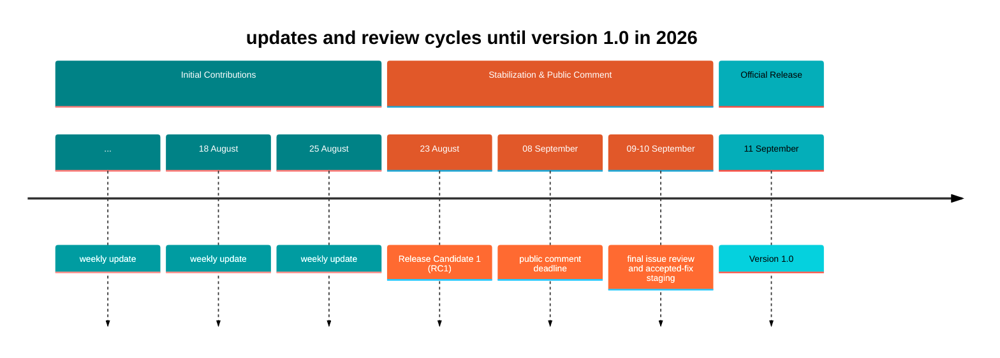
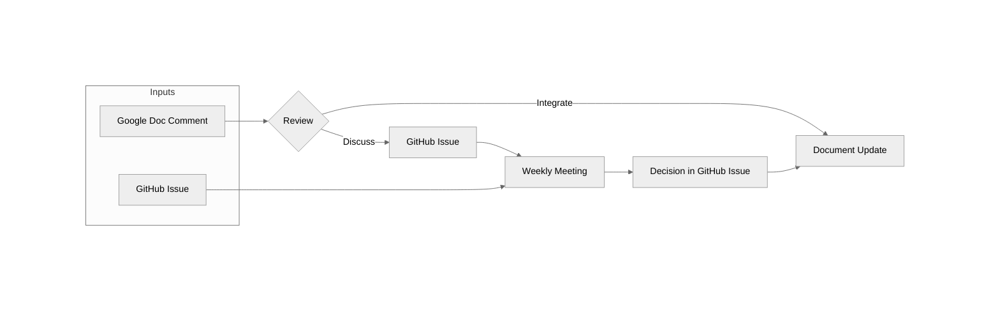

# OpenChain CRA Compliance Requirements & Checklist review & contribution workflow

[简体中文](CONTRIBUTING.md) | **English**

> The release timetable and process status below are historical source information, preserved from commit `cd497f7a5a8daca97e50d049bfd9d4a6c60376e9`. Repository-specific bilingual maintenance rules follow at the end.

> [!IMPORTANT]
> **Legacy information**
> 
> The contribution process will be updated for post-v1.0 contribution. Expect updates in the coming days.
>
> Feedback via [GitHub issues](https://github.com/OpenChain-Project/CRA-Compliance/issues) is welcome any time.
> 
> For active discussion and further participation, everyone is invited to join the Study Group meetings and mailing list:
> - [Calendar](https://openchainproject.org/participate)
>   - OpenChain Business Operations Study Group EU/ASIA on Monday 11:00 UTC (bi-weekly)
>   - OpenChain Business Operations Study Group NA/EU (CRA Checklist focus) on Tuesday 14:00 UTC
> - [Mailing list](https://lists.openchainproject.org/g/OpenChain-BusinessOps-Study-Group)

The OpenChain CRA Compliance Requirements & Checklist is a community-maintained, OpenChain-aligned self-certification and readiness resource for organizations preparing for EU Cyber Resilience Act obligations.

Feedback and proposed changes are tracked through GitHub issues and pull requests. Community comments may also be submitted through the public Google Doc during review windows. The Business Operations Study Group mailing list may be used for broader discussion.

For detailed information and valid channels per release phase see details below:
- [Public Comment Phase - after RC1](#public-comment-phase---after-rc1) (concluded)
- [Initial Contribution Phase - before RC1](#initial-contribution-phase---before-rc1) (concluded)

## Timeline & Release schedule

**Milestones:** [Release Candidate 1 (RC1)](https://github.com/OpenChain-Project/CRA-Compliance/milestone/1) | [Version 1.0](https://github.com/OpenChain-Project/CRA-Compliance/milestone/3)

## Review Process

### Public Comment Phase - after RC1
The Public Comment phase aligns with the [**OpenChain Process for Public Comment Periods**](https://openchainproject.org/processes#process-public-comments). 

During review windows, feedback is collected through:
- The [Business Operations Study Group mailing list](https://lists.openchainproject.org/g/OpenChain-BusinessOps-Study-Group/)
- The [CRA Compliance GitHub repository](https://github.com/OpenChain-Project/CRA-Compliance) in the form of GitHub issues or pull requests
- The [Google Doc](https://docs.google.com/document/d/1Wog28BZ9NQhY3tN9Wc2NDml2phBDuvYu9zkXSON5z5o/edit?usp=sharing)

**At the conclusion of the public comment period, collected issues are addressed by the Study Group through scheduled calls, GitHub review, or the mailing list.**

> [!NOTE]
> Version 1.0 has been released. Future changes should be proposed through GitHub issues or pull requests and considered for a later release.

---

### Initial Contribution Phase - before RC1
> [!IMPORTANT]  
> The Initial Contribution Phase is concluded.

You may contribute by:

- Commenting or suggesting changes in the Google Doc during an open review window
- Opening a GitHub issue
- Submitting a GitHub pull request

Use whichever platform you prefer.

1. Feedback from both the Google Doc and GitHub is reviewed regularly.
2. Prior to each document update, open Google Doc comments are reviewed and resolved:
   - Comments that can be addressed directly are marked for integration and incorporated into the next document revision.
   - Comments requiring further discussion, clarification, or community consensus are transferred to a GitHub issue for tracking. A link to the new issue is added to the Google Doc comment.
3. Open GitHub issues are reviewed and discussed during the weekly review meetings.
4. Decisions and their rationale are recorded in the corresponding GitHub issue.
5. Agreed changes are incorporated into the checklist.
6. Once a change has been implemented or a decision has been reached, the corresponding issue is closed.

## Tracking Discussions and Decisions

To maintain transparency and avoid losing feedback:

- GitHub issues are used to track topics that require discussion, decisions, or follow-up actions.
- GitHub issues may reference related Google Doc comments, and vice versa.
- Decisions and their rationale are documented in the corresponding GitHub issue.
- Contributors are encouraged to review existing comments and issues before creating new ones on the same topic.

## Communication

Updates on the review process, document iterations, and significant decisions will be communicated through the [**OpenChain Business Operations Study Group mailing list**](https://lists.openchainproject.org/g/OpenChain-BusinessOps-Study-Group).

Major updates, milestones, and review announcements may also be shared on the [**OpenChain main mailing list**](https://lists.openchainproject.org/g/main) to ensure broader community visibility.

## Bilingual maintenance in this repository

These repository-specific rules supplement the upstream guide above.

- Report translation, link, or formatting issues through [this repository's issues](https://github.com/mingsun7-max/CRA-Compliance-CN/issues) or pull requests, identifying the language, file, checklist item, and source text.
- Root documents default to Chinese; English files use `.en.md`. Keep reciprocal language links and review the other language when updating content.
- Archive versioned checklists in their version directories. The Chinese and English root `latest` files each display the complete current version. Keep each versioned file and its corresponding `latest` text synchronized, adjusting relative links. Historical drafts are not substitutes for the current checklist.
- Preserve must/must not, should, and may distinctions, legal references, numbering, qualifications, fill-in fields, and attribution. Flag legal issues in the source separately rather than silently rewriting them.
- Propose substantive source changes upstream and record translation changes in the [translation notes](TRANSLATION_NOTES.en.md). Do not describe translations or checklist use as official approval or compliance certification.
