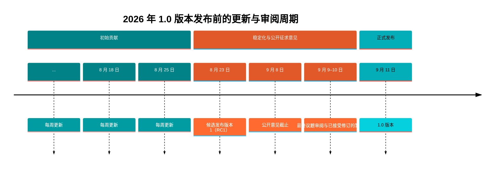
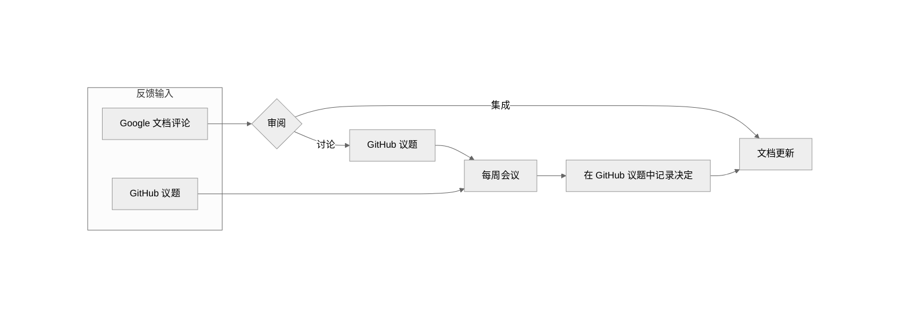

# 审阅与贡献指南

**简体中文** | [English](CONTRIBUTING.en.md)

> 本文译自上游贡献指南，基准提交为 `cd497f7a5a8daca97e50d049bfd9d4a6c60376e9`。以下版本日程和流程状态按原文保留；本仓库的双语维护规则见文末。

> [!IMPORTANT]
> **历史流程信息**
>
> 贡献流程将针对 1.0 发布后的贡献进行更新，预计将在随后数日更新。
>
> 欢迎随时通过 [GitHub 议题](https://github.com/OpenChain-Project/CRA-Compliance/issues)反馈。
>
> 欢迎参加研究组会议及邮件列表，参与讨论和后续工作：
> - [日历](https://openchainproject.org/participate)
>   - OpenChain 业务运营研究组欧洲／亚洲会议：每两周一次，周一 11:00 UTC。
>   - OpenChain 业务运营研究组北美／欧洲会议（重点讨论 CRA 清单）：周二 14:00 UTC。
> - [邮件列表](https://lists.openchainproject.org/g/OpenChain-BusinessOps-Study-Group)

《OpenChain CRA 合规要求与检查清单》是一项由社区维护、与 OpenChain 保持一致的自我认证与准备度参考资源，供组织为履行欧盟《网络韧性法案》义务作准备。

反馈与修改建议通过 GitHub 议题和拉取请求跟踪。在审阅窗口内，也可以通过公开 Google 文档提交社区意见。业务运营研究组邮件列表可用于更广泛的讨论。

各发布阶段的详情及有效渠道如下：

- [RC1 之后的公开征求意见阶段](#public-comment-phase---after-rc1)（已结束）
- [RC1 之前的初始贡献阶段](#initial-contribution-phase---before-rc1)（已结束）

## 时间线与发布安排

**里程碑：** [候选发布版本 1（RC1）](https://github.com/OpenChain-Project/CRA-Compliance/milestone/1) | [1.0 版本](https://github.com/OpenChain-Project/CRA-Compliance/milestone/3)

## 审阅流程

### RC1 之后的公开征求意见阶段

公开征求意见阶段遵循 [OpenChain 公开征求意见程序](https://openchainproject.org/processes#process-public-comments)。

审阅窗口内，通过以下渠道收集反馈：

- [业务运营研究组邮件列表](https://lists.openchainproject.org/g/OpenChain-BusinessOps-Study-Group/)
- [CRA 合规 GitHub 仓库](https://github.com/OpenChain-Project/CRA-Compliance)中的议题或拉取请求
- [Google 文档](https://docs.google.com/document/d/1Wog28BZ9NQhY3tN9Wc2NDml2phBDuvYu9zkXSON5z5o/edit?usp=sharing)

**公开征求意见期结束后，研究组通过定期会议、GitHub 审阅或邮件列表处理收集到的问题。**

> [!NOTE]
> 1.0 版本已发布。后续修改应通过 GitHub 议题或拉取请求提出，并考虑纳入之后的版本。

### RC1 之前的初始贡献阶段

> [!IMPORTANT]
> 初始贡献阶段已结束。

可以通过以下方式贡献：

- 在开放审阅窗口内对 Google 文档发表评论或修改建议；
- 创建 GitHub 议题；
- 提交 GitHub 拉取请求。

请选择您偏好的平台。

1. 定期审阅 Google 文档及 GitHub 的反馈。
2. 每次文档更新前，审阅并处理 Google 文档中未解决的评论。可直接处理的评论标记为待集成，并纳入下次修订；需要进一步讨论、澄清或社区共识的评论转为 GitHub 议题跟踪，并在原评论中加入议题链接。
3. 在每周审阅会议中审阅、讨论未关闭的 GitHub 议题。
4. 在相应 GitHub 议题中记录决定及理由。
5. 将商定的修改纳入清单。
6. 修改已实施或已作出决定后，关闭相应议题。

## 跟踪讨论与决定

为保持透明并避免遗漏反馈：

- 使用 GitHub 议题跟踪需要讨论、决定或后续行动的事项。
- GitHub 议题与相关 Google 文档评论可以相互引用。
- 在相应 GitHub 议题中记录决定及理由。
- 鼓励贡献者在就同一主题创建新议题前，先查阅现有评论和议题。

## 沟通

审阅流程、文档迭代及重大决定的更新通过 [OpenChain 业务运营研究组邮件列表](https://lists.openchainproject.org/g/OpenChain-BusinessOps-Study-Group)沟通。

重大更新、里程碑及审阅公告也可以通过 [OpenChain 主邮件列表](https://lists.openchainproject.org/g/main)分享，使更广泛的社区知悉。

## 本仓库双语维护规则

以下为本仓库补充规则，不属于上游指南原文。

- 翻译、链接或排版问题请在[本仓库议题](https://github.com/mingsun7-max/CRA-Compliance-CN/issues)或拉取请求中提出，并标明语言、文件、检查项编号及原文依据。
- 根目录默认中文，英文采用 `.en.md` 后缀；相应文件须保留双向语言入口。更新正文时同步检查对应语言。
- 版本清单在相应版本目录归档；根目录中英文 `latest` 文件分别展示最新版本全文。更新清单时须同步对应语言的版本文件和 `latest` 全文，并调整相对链接。历史稿不得作为当前清单替代品。
- 译文须区分“必须／不得”“宜”“可以”，保留法条、编号、限定条件、填写栏及原作署名。对原文的法律疑点须单独注明，不作未标示的改写。
- 原清单实质修订提交至上游；翻译变更记录于[翻译说明](TRANSLATION_NOTES.md)。请勿将译文或清单使用情况描述为官方认可或合规认证。
